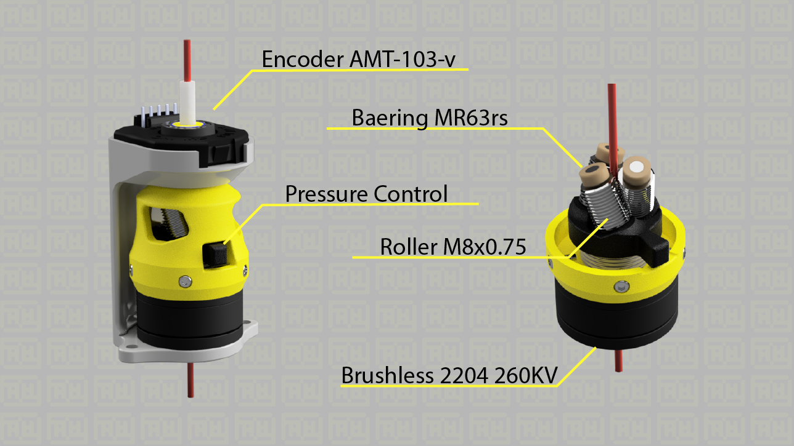
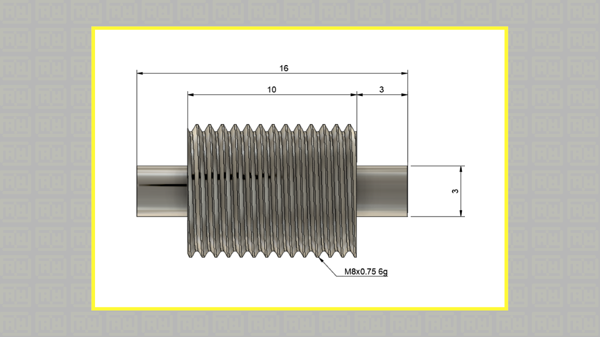
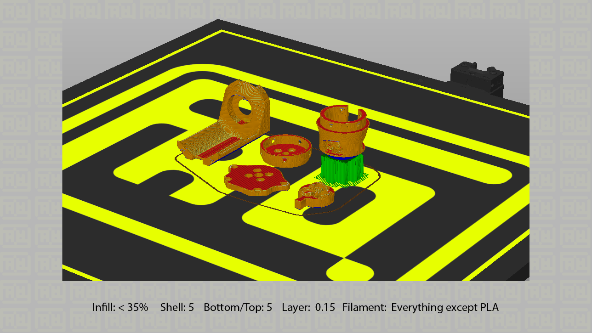

# Axial Rotation Servo Extruder (WIP - Work in Progress)

# PAY ATTENTION

The Closed Loop firmware has not yet been completed, 
but for now it is possible to use the extruder in Open Loop mode with the ARSI firmware for klipper
[Link](https://github.com/arsi-apli/BLDC_Klipper_doc)

Unfortunately for now the only difficulty in accessing the project is the creation of the rollers that are not available on the market, 
but you can create them if you can through the drawing that I have provided.

# Social

- [Instagram](https://www.instagram.com/faq_t0tum/)
- [Discord](https://discord.gg/tgut7grRTV)
- [YouTube](https://www.youtube.com/channel/UCHJ_528ZI0BcSU-QA8kIJlg)
- [PrusaPrinter](https://www.prusaprinters.org/social/218145-faqtotum/about)

# Buy me a coffee

The ORBION project is OpenSource so if you have the pleasure of supporting my next works I will be grateful fot the coffee.  
[PayPal](https://www.paypal.me/MattiaRusso308?locale.x=it_IT)

# BOM

Componets:

- [Bearing MR63rs (6pcs)]()
- [Springs multi wave OD(max):19mm Height:8mm (1pcs)]()
- [M2x4 (13pcs)]()
- [M2x8 (2pcs)]()
- [Encoder ATM 103-v (1pcs)]()
- [SimpleFOC 2.0.4 (1pcs)]()
- [Arduino Uno (1pcs)]()
- [Brushless Gimbal 2204 260KV]()
- [Bearing 6800zz (1pcs)]() 

# License 
### [Attribution-NonCommercial 4.0 International](https://creativecommons.org/licenses/by-nc-nd/4.0/)
 This work is licensed under a <a rel="license" href="http://creativecommons.org/licenses/by/4.0/">Creative Commons Attribution 4.0 International License</a>.

You are free to:
- Share — copy and redistribute the material in any medium or format
- Adapt - remix, transform, and build upon the material

Under the following terms:
- Attribution —  You must give appropriate credit, provide a link to the license, and indicate if changes were made. You may do so in any reasonable manner, but not in any way that suggests the licensor endorses you or your use.
- NonCommercial — You may not use the material for commercial purposes.

